# big-equity

A poker equity simulator, packaged as a container and deployed to a self-hosted
EC2 Docker host via GitHub Actions.

Each deployable lives under `containers/<name>/`. The provisioning and
deployment machinery — Terraform, the EC2 host, the CI pipelines, secrets, and
the full setup guide — lives in **[`infra/README.md`](infra/README.md)**.
Technology choices follow the defaults in
**[`docs/steering/tech-stack.md`](docs/steering/tech-stack.md)**.

---

## Containers

| Container | Summary | Readme |
| --- | --- | --- |
| `simulationPY` | Poker equity simulator — given hero/villain hands and a board, it runs out the remaining cards and reports each player's equity. Stdlib-only Python. | [containers/simulationPY/README.md](containers/simulationPY/README.md) |
| `simulationTS` | TypeScript rewrite of the poker equity simulator. Monte Carlo simulator for 5-card Omaha Hi-Lo with hand evaluation and pot-split logic. | [containers/simulationTS/README.md](containers/simulationTS/README.md) |
| `simulationWeb` | Browser front-end for the equity simulator. React 19 + TypeScript + Vite, served static via nginx; currently a bare scaffold being built up incrementally. | [containers/simulationWeb/README.md](containers/simulationWeb/README.md) |
| `simulationAPI` | Fastify HTTP API backend (TypeScript, zod-validated routes); will be the CRUD layer in front of a future private DB container. | [containers/simulationAPI/README.md](containers/simulationAPI/README.md) |
| `simulationDB` | PostgreSQL database (upstream `postgres:18-alpine`, no Dockerfile). Docker-network-only — no host ports; simulationAPI is its sole client. | [containers/simulationDB/README.md](containers/simulationDB/README.md) |
| `fusionAuth` | Self-hosted identity provider (upstream `fusionauth/fusionauth-app`, no Dockerfile). Reuses simulationDB (its own `fusionauth` database, no bundled Postgres); OpenSearch off (`SEARCH_TYPE=database`). | [containers/fusionAuth/README.md](containers/fusionAuth/README.md) |
| `reverseProxy` | The public edge: nginx + certbot in one image. Terminates TLS for all three hostnames on 80/443, routes to the other containers over `simulation-net`, and owns the Let's Encrypt issue/renew loop. | [containers/reverseProxy/README.md](containers/reverseProxy/README.md) |

### Public internet exposure

| Container | Exposed | URL |
| --- | --- | --- |
| `simulationPY` | No | Internal only |
| `simulationTS` | No | Internal only |
| `simulationWeb` | Via proxy | https://allin.makejohnacoffee.com — behind a FusionAuth login ([ADR-007](docs/adr/007-fusionauth-login-wall.md)); no host ports, Docker network only |
| `simulationAPI` | Via proxy | https://api.makejohnacoffee.com (per [ADR-002](docs/adr/002-fastify-backend-container.md)); also serves the whole `allin.…` vhost as the SPA's login-wall gateway ([ADR-007](docs/adr/007-fusionauth-login-wall.md)/[ADR-010](docs/adr/010-gateway-in-simulationapi.md)); no host ports |
| `simulationDB` | No | Docker network only ([ADR-003](docs/adr/003-simulationdb-container.md)); dev-only toggle per [ADR-005](docs/adr/005-simulationdb-dev-access-toggle.md) |
| `fusionAuth` | Via proxy | https://id.makejohnacoffee.com (per [ADR-006](docs/adr/006-fusionauth-container.md)); no host ports |
| `reverseProxy` | **Yes — the only one** | Publishes 80/443 and fronts the three rows above ([ADR-009](docs/adr/009-reverse-proxy-container.md)) |

How the exposure works (see [ADR-001](docs/adr/001-expose-simulationweb.md); the API follows the same pattern per [ADR-002](docs/adr/002-fastify-backend-container.md), plus per-IP rate limiting at the proxy — which since [ADR-009](docs/adr/009-reverse-proxy-container.md) is itself a container):

```mermaid
%%{init: {'themeVariables': {'edgeLabelBackground': '#000000'}}}%%
graph TD
    subgraph BG[" "]
    direction TB
    Client["🌐 Browser<br/><b>https://allin.makejohnacoffee.com</b>"]
    APIClient["🌐 API client<br/><b>https://api.makejohnacoffee.com</b>"]
    AuthClient["🌐 Login / OIDC<br/><b>https://id.makejohnacoffee.com</b>"]
    LE["🔐 Let's Encrypt CA<br/>ACME"]

    Client --> Port80
    Client -- "DNS → 35.169.127.234" --> Port443
    APIClient --> Port80
    APIClient -- "DNS → 35.169.127.234" --> Port443
    AuthClient --> Port80
    AuthClient -- "DNS → 35.169.127.234" --> Port443

    subgraph EC2["AWS EC2 Instance · t3.micro<br/>Amazon Linux 2023 (latest via SSM)"]
        direction TB

        subgraph SG["🛡️ Security Group · ingress"]
            direction LR
            Port80[":80 HTTP<br/>allow 0.0.0.0/0"]
            Port443[":443 HTTPS<br/>allow 0.0.0.0/0"]
        end
        Port80 -. "301 redirect" .-> Port443

        Certs[("/etc/letsencrypt<br/>host dir, bind-mounted<br/>one cert per subdomain")]

        subgraph Docker["Docker containers"]
            direction LR
            Nginx["<b>reverseProxy</b> (ADR-009)<br/>nginx + certbot · :80/:443<br/>hostname routing · TLS termination<br/>cert issue + renew 2×/day"]
            Web["<b>simulationWeb</b><br/>nginx:alpine · static<br/>behind simulationAPI's wall · no host ports"]
            API["simulationAPI<br/>Fastify · node:24-alpine<br/>🌍 via reverseProxy · no host ports<br/>data API + app gateway (ADR-007/010)"]
            PY["simulationPY<br/>python:3.14-alpine<br/>batch · no ports · 🔒 private"]
            TS["simulationTS<br/>node:24-alpine<br/>batch · no ports · 🔒 private"]
            Auth["fusionAuth<br/>identity provider (IdP) · JVM<br/>🌍 via reverseProxy · no host ports<br/>login pages · /oauth2/* · admin UI"]
        end

        Port443 --> Nginx
        Nginx -- "allin · whole vhost<br/>proxy_pass simulationapi:3003<br/>(wall lives inside simulationAPI, ADR-010)" --> API
        Nginx -- "api · / (data API)<br/>proxy_pass simulationapi:3003" --> API
        Nginx -- "id · / (OIDC + admin)<br/>proxy_pass fusionauth:9011" --> Auth
        API -- "valid session → proxy the SPA<br/>anonymous → 302 /auth/login (ADR-010)" --> Web
        API -. "OIDC back-channel:<br/>code → token exchange · JWKS<br/>(browser never sees tokens)" .-> Auth
    end

    Nginx -- "1. cert request (ACME, webroot)" --> LE
    LE -. "2. HTTP-01 challenge<br/>GET /.well-known/acme-challenge/…" .-> Port80
    Nginx -- "3. writes certs, reloads itself" --> Certs
    Certs -- "4. bind-mounted back in<br/>ssl_certificate(_key)" --> Nginx
    end

    style BG fill:#000000,stroke:#000000
    style Client fill:#0c2d54,stroke:#3b82f6,stroke-width:2px,color:#ffffff
    style APIClient fill:#0c2d54,stroke:#3b82f6,stroke-width:2px,color:#ffffff
    style AuthClient fill:#0c2d54,stroke:#3b82f6,stroke-width:2px,color:#ffffff
    style LE fill:#2e1065,stroke:#a855f7,stroke-width:2px,color:#ffffff
    style Port80 fill:#3d2109,stroke:#f97316,stroke-width:2px,color:#ffffff
    style Port443 fill:#3d2109,stroke:#f97316,stroke-width:2px,color:#ffffff
    style Nginx fill:#0c3d1f,stroke:#22c55e,stroke-width:2px,color:#ffffff
    style Web fill:#0c3d1f,stroke:#22c55e,stroke-width:2px,color:#ffffff
    style API fill:#0c3d1f,stroke:#22c55e,stroke-width:2px,color:#ffffff
    style Auth fill:#0c3d1f,stroke:#22c55e,stroke-width:2px,color:#ffffff
    style PY fill:#3f0f0f,stroke:#ef4444,stroke-width:2px,color:#ffffff
    style TS fill:#3f0f0f,stroke:#ef4444,stroke-width:2px,color:#ffffff
    style Certs fill:#2e1065,stroke:#a855f7,stroke-width:2px,color:#ffffff
    style EC2 fill:transparent,stroke:#94a3b8,stroke-dasharray:6 4,color:#ffffff
    style SG fill:transparent,stroke:#eab308,stroke-dasharray:6 4,stroke-width:2px,color:#ffffff
    style Docker fill:transparent,stroke:#94a3b8,stroke-dasharray:6 4,color:#ffffff
    linkStyle default stroke:#94a3b8,color:#ffffff
```



### Who handles which URL

Three public hostnames, one edge, two backends behind it. The edge
(reverseProxy) only routes by hostname; everything app-aware happens inside
simulationAPI, the app gateway ([ADR-010](docs/adr/010-gateway-in-simulationapi.md)):

| URL | Routed | Role | What happens there |
| --- | --- | --- | --- |
| `allin.…/` (and any SPA path) | edge → `simulationapi:3003` → `simulationweb:80` | The app, behind the wall | simulationAPI checks the `be_session` cookie: valid → proxies the request through to the static SPA; anonymous → 302 to `/auth/login?rd=<original path>`. |
| `allin.…/auth/login` | edge → `simulationapi:3003` | OIDC relying party | Starts a login: stores `state`/`nonce` in a short-lived signed cookie, then redirects the browser to `id.…/oauth2/authorize`. |
| `allin.…/auth/callback` | edge → `simulationapi:3003` | OIDC relying party | Where FusionAuth sends the browser back after login. Exchanges the one-time code for tokens by calling `id.…/oauth2/token` **server-to-server**, validates the `id_token`, mints the `be_session` cookie. |
| `allin.…/auth/me` | edge → `simulationapi:3003` | Session info | Returns the signed-in user's `sub`/`email`/`name` so the SPA can show who's logged in. |
| `allin.…/auth/logout` | edge → `simulationapi:3003` | Logout | Clears the session cookie, then redirects to `id.…/oauth2/logout` so the FusionAuth SSO session ends too. |
| `api.…/*` | edge → `simulationapi:3003` | Data API | The poker-equity REST endpoints (ADR-002). Same process as the gateway, different hostname. |
| `api.…/auth/*`, `api.…/<SPA paths>` | 404 inside simulationAPI | Hardening | The gateway routes carry a Fastify `host` constraint for `allin.…` — on any other hostname they don't exist (ADR-010). |
| `id.…/oauth2/*`, `id.…/.well-known/*` | edge → `fusionauth:9011` | Identity provider | Hosted login page, code/token issuance, JWKS. Knows the users; never sees app traffic. |
| `id.…/admin` | edge → `fusionauth:9011` | IdP admin UI | Manage users and the `poker_equity` application registration. |

And the login round-trip, in order (ADR-007):

| # | Browser is at | Talks to | Result |
| --- | --- | --- | --- |
| 1 | `allin.…/some/page` | simulationAPI's wall finds no session | Redirected to `allin.…/auth/login?rd=/some/page` |
| 2 | `allin.…/auth/login` | simulationAPI | Gets `be_auth_tx` cookie; redirected to `id.…/oauth2/authorize?…` |
| 3 | `id.…/oauth2/authorize` | fusionAuth | Sees the login form, enters credentials |
| 4 | `allin.…/auth/callback?code=…` | simulationAPI → fusionAuth (back-channel token exchange) | Gets `be_session` cookie; redirected to `/some/page` |
| 5 | `allin.…/some/page` | simulationAPI's wall sees the session | SPA proxied through from simulationWeb |

The browser only ever holds cookies — the OAuth code is single-use and the
tokens never leave the server side (step 4's exchange is simulationAPI calling
FusionAuth directly, not the browser).

---

## Repository layout

```
.
├── cmd                      # launcher for the scripts in scripts/ — ./cmd lists them
├── containers/              # one self-contained, deployable container per dir
├── docs/                    # ADRs (docs/adr/), stories (docs/stories/), steering docs (docs/steering/)
├── infra/                   # Terraform + deployment — see infra/README.md
├── scripts/                 # operator tooling, run from your machine
└── .github/workflows/       # infra.yml (terraform), deploy.yml (build + ship)
```

---

## Scripts

Operator tooling under `scripts/` — run from your machine, nothing to install
on the box. Call everything through [`cmd`](cmd), the launcher at the repo
root (no shell config needed — but note the leading `./`; zsh/bash won't find
a bare `cmd`):

```sh
./cmd                    # list available commands
./cmd monitor            # live watch-style view (".sh" suffix optional); ctrl-c to exit
./cmd monitor --snap     # one-shot health snapshot
./cmd db-access enable   # open 5432 to your current public IP
./cmd db-access disable  # close 5432 when you're done
```

Arguments after the command name pass through to the script, so
`./cmd monitor --snap` runs `scripts/monitor.sh --snap`. Any executable
`<name>.sh` added to `scripts/` becomes a `./cmd <name>` command
automatically.

| Script | What it does |
| --- | --- |
| [`scripts/monitor.sh`](scripts/monitor.sh) | Health/CPU/mem/disk/network view of the EC2 host and its containers over SSH. Default is a live watch-style table (one row per container plus a `NODE` row) with net/disk as per-second rates; `--snap` prints a one-shot snapshot instead. Resolves the host from `$EC2_HOST` or `terraform output`. |
| [`scripts/db-access.sh`](scripts/db-access.sh) | Toggle dev-only public access to simulationDB (ADR-005). `enable` detects your current public IP and dispatches the [db-access workflow](.github/workflows/db-access.yml) to open 5432 to it; `disable` closes it. Follows the run to completion via `gh run watch`. Requires the `gh` CLI. |

---

## Adding another container

1. Create `containers/<newname>/` with a `Dockerfile` and a `docker-compose.yml`
   (copy `simulationPY`'s as a template; point the compose `image` default at
   `ghcr.io/YOURUSER/big-equity/<newname>` — lowercased, GHCR requires it).
   Running an upstream image instead? Skip the Dockerfile — a compose-only
   directory deploys without the build step (like `simulationDB`).
2. If it needs secrets, drop an `.env` on the box once — see [step 6 in the infra guide](infra/README.md#6-optional-give-a-container-its-env). Otherwise there's nothing to seed; the deploy pipeline syncs the compose file for you.
3. Push to `main` — the deploy pipeline auto-discovers the new folder and ships it.

That's the whole loop. For how the pipelines, host, and secrets fit together,
read **[`infra/README.md`](infra/README.md)**.

---

## Deployment

See **[`infra/README.md`](infra/README.md)** for the architecture, one-time
setup, day-to-day workflow, and cost.
