# big-equity

A poker equity simulator, packaged as a container and deployed to a self-hosted
EC2 Docker host via GitHub Actions.

Each deployable lives under `containers/<name>/`. The provisioning and
deployment machinery — Terraform, the EC2 host, the CI pipelines, secrets, and
the full setup guide — lives in **[`infra/README.md`](infra/README.md)**.

---

## Containers

| Container | Summary | Readme |
| --- | --- | --- |
| `simulationPY` | Poker equity simulator — given hero/villain hands and a board, it runs out the remaining cards and reports each player's equity. Stdlib-only Python. | [containers/simulationPY/README.md](containers/simulationPY/README.md) |
| `simulationTS` | TypeScript rewrite of the poker equity simulator. Monte Carlo simulator for 5-card Omaha Hi-Lo with hand evaluation and pot-split logic. | [containers/simulationTS/README.md](containers/simulationTS/README.md) |
| `simulationWeb` | Browser front-end for the equity simulator. React + Framer Motion; the Monte Carlo runs client-side in a Web Worker. Served static via nginx. | [containers/simulationWeb/README.md](containers/simulationWeb/README.md) |

### Public internet exposure

| Container | Exposed | URL |
| --- | --- | --- |
| `simulationPY` | No | Internal only |
| `simulationTS` | No | Internal only |
| `simulationWeb` | Yes | https://allin.makejohnacoffee.com |

How the exposure works (see [ADR-001](docs/adr/001-expose-simulationweb.md)):

```mermaid
%%{init: {'themeVariables': {'edgeLabelBackground': '#000000'}}}%%
graph TD
    subgraph BG[" "]
    direction TB
    Client["🌐 Browser<br/><b>https://allin.makejohnacoffee.com</b>"]
    LE["🔐 Let's Encrypt CA<br/>ACME"]

    Client -- "DNS → 35.169.127.234" --> Port80
    Client -- "DNS → 35.169.127.234" --> Port443

    subgraph EC2["AWS EC2 Instance"]
        direction TB

        subgraph SG["🛡️ Security Group · ingress"]
            direction LR
            Port80[":80 HTTP<br/>allow 0.0.0.0/0"]
            Port443[":443 HTTPS<br/>allow 0.0.0.0/0"]
        end
        Port80 -. "301 redirect" .-> Port443

        Nginx["<b>Nginx Reverse Proxy</b><br/>hostname-based routing<br/>TLS termination"]
        Port443 --> Nginx

        Certbot["certbot<br/>installed via user_data.sh.tftpl"]
        Certs[("/etc/letsencrypt/live/<br/>allin.makejohnacoffee.com/<br/>fullchain.pem · privkey.pem")]
        Timer["⏱ certbot renew<br/>systemd timer · 2×/day"]

        subgraph Docker["Docker containers"]
            direction LR
            Web["<b>simulationWeb</b><br/>:8080 · 🌍 exposed"]
            PY["simulationPY<br/>:3001 · 🔒 private"]
            TS["simulationTS<br/>:3002 · 🔒 private"]
        end

        Nginx -- "proxy_pass<br/>localhost:8080" --> Web
    end

    Certbot -- "1. cert request (ACME)" --> LE
    LE -. "2. HTTP-01 challenge<br/>GET /.well-known/acme-challenge/…" .-> Port80
    Certbot -- "3. writes certs" --> Certs
    Certs -- "4. loaded via ssl_certificate /<br/>ssl_certificate_key" --> Nginx
    Timer -. "renew + reload nginx" .-> Certbot
    end

    style BG fill:#000000,stroke:#000000
    style Client fill:#0c2d54,stroke:#3b82f6,stroke-width:2px,color:#ffffff
    style LE fill:#2e1065,stroke:#a855f7,stroke-width:2px,color:#ffffff
    style Port80 fill:#3d2109,stroke:#f97316,stroke-width:2px,color:#ffffff
    style Port443 fill:#3d2109,stroke:#f97316,stroke-width:2px,color:#ffffff
    style Nginx fill:#0c3d1f,stroke:#22c55e,stroke-width:2px,color:#ffffff
    style Web fill:#0c3d1f,stroke:#22c55e,stroke-width:2px,color:#ffffff
    style PY fill:#3f0f0f,stroke:#ef4444,stroke-width:2px,color:#ffffff
    style TS fill:#3f0f0f,stroke:#ef4444,stroke-width:2px,color:#ffffff
    style Certbot fill:#2e1065,stroke:#a855f7,stroke-width:2px,color:#ffffff
    style Certs fill:#2e1065,stroke:#a855f7,stroke-width:2px,color:#ffffff
    style Timer fill:#2e1065,stroke:#a855f7,stroke-width:2px,color:#ffffff
    style EC2 fill:transparent,stroke:#94a3b8,stroke-dasharray:6 4,color:#ffffff
    style SG fill:transparent,stroke:#eab308,stroke-dasharray:6 4,stroke-width:2px,color:#ffffff
    style Docker fill:transparent,stroke:#94a3b8,stroke-dasharray:6 4,color:#ffffff
    linkStyle default stroke:#94a3b8,color:#ffffff
```



---

## Repository layout

```
.
├── containers/              # one self-contained, deployable container per dir
│   ├── simulationPY/        # poker equity simulator (Python)
│   ├── simulationTS/        # poker equity simulator (TypeScript)
│   └── simulationWeb/       # browser UI for the simulator
├── infra/                   # Terraform + deployment — see infra/README.md
└── .github/workflows/       # infra.yml (terraform), deploy.yml (build + ship)
```

---

## Adding another container

1. Create `containers/<newname>/` with a `Dockerfile` and a `docker-compose.yml`
   (copy `simulationPY`'s as a template; point the compose `image` default at
   `ghcr.io/YOURUSER/big-equity/<newname>` — lowercased, GHCR requires it).
2. If it needs secrets, drop an `.env` on the box once — see [step 6 in the infra guide](infra/README.md#6-optional-give-a-container-its-env). Otherwise there's nothing to seed; the deploy pipeline syncs the compose file for you.
3. Push to `main` — the deploy pipeline auto-discovers the new folder and ships it.

That's the whole loop. For how the pipelines, host, and secrets fit together,
read **[`infra/README.md`](infra/README.md)**.

---

## Deployment

See **[`infra/README.md`](infra/README.md)** for the architecture, one-time
setup, day-to-day workflow, and cost.
