# big-equity

A poker equity simulator, packaged as a container and deployed to a self-hosted
EC2 Docker host via GitHub Actions.

Each deployable lives under `containers/<name>/`. The provisioning and
deployment machinery — Terraform, the EC2 host, the CI pipelines, secrets, and
the full setup guide — lives in **[`infra/README.md`](infra/README.md)**.
Technology choices follow the defaults in
**[`docs/steering/tech-stack.md`](docs/steering/tech-stack.md)**.

---

## Containers

| Container | Summary | Readme |
| --- | --- | --- |
| `simulationPY` | Poker equity simulator — given hero/villain hands and a board, it runs out the remaining cards and reports each player's equity. Stdlib-only Python. | [containers/simulationPY/README.md](containers/simulationPY/README.md) |
| `simulationTS` | TypeScript rewrite of the poker equity simulator. Monte Carlo simulator for 5-card Omaha Hi-Lo with hand evaluation and pot-split logic. | [containers/simulationTS/README.md](containers/simulationTS/README.md) |
| `simulationWeb` | Browser front-end for the equity simulator. React 19 + TypeScript + Vite, served static via nginx; currently a bare scaffold being built up incrementally. | [containers/simulationWeb/README.md](containers/simulationWeb/README.md) |
| `simulationAPI` | Fastify HTTP API backend (TypeScript, zod-validated routes); will be the CRUD layer in front of a future private DB container. | [containers/simulationAPI/README.md](containers/simulationAPI/README.md) |
| `simulationDB` | PostgreSQL database (upstream `postgres:18-alpine`, no Dockerfile). Docker-network-only — no host ports; simulationAPI is its sole client. | [containers/simulationDB/README.md](containers/simulationDB/README.md) |

### Public internet exposure

| Container | Exposed | URL |
| --- | --- | --- |
| `simulationPY` | No | Internal only |
| `simulationTS` | No | Internal only |
| `simulationWeb` | Yes | https://allin.makejohnacoffee.com |
| `simulationAPI` | Yes (provisioned at boot; live after the next box rebuild) | https://api.makejohnacoffee.com (per [ADR-002](docs/adr/002-fastify-backend-container.md)) |
| `simulationDB` | No | Docker network only ([ADR-003](docs/adr/003-simulationdb-container.md)); dev-only toggle per [ADR-005](docs/adr/005-simulationdb-dev-access-toggle.md) |

How the exposure works (see [ADR-001](docs/adr/001-expose-simulationweb.md); the API follows the same pattern per [ADR-002](docs/adr/002-fastify-backend-container.md), plus per-IP rate limiting at the proxy):

```mermaid
%%{init: {'themeVariables': {'edgeLabelBackground': '#000000'}}}%%
graph TD
    subgraph BG[" "]
    direction TB
    Client["🌐 Browser<br/><b>https://allin.makejohnacoffee.com</b>"]
    APIClient["🌐 API client<br/><b>https://api.makejohnacoffee.com</b>"]
    LE["🔐 Let's Encrypt CA<br/>ACME"]

    Client --> Port80
    Client -- "DNS → 35.169.127.234" --> Port443
    APIClient --> Port80
    APIClient -- "DNS → 35.169.127.234" --> Port443

    subgraph EC2["AWS EC2 Instance · t3.micro<br/>Amazon Linux 2023 (latest via SSM)"]
        direction TB

        subgraph SG["🛡️ Security Group · ingress"]
            direction LR
            Port80[":80 HTTP<br/>allow 0.0.0.0/0"]
            Port443[":443 HTTPS<br/>allow 0.0.0.0/0"]
        end
        Port80 -. "301 redirect" .-> Port443

        Nginx["<b>Nginx Reverse Proxy</b><br/>hostname-based routing<br/>TLS termination"]
        Port443 --> Nginx

        Certbot["certbot<br/>installed via user_data.sh.tftpl"]
        Certs[("/etc/letsencrypt/live/<br/>allin.makejohnacoffee.com/<br/>fullchain.pem · privkey.pem")]
        Timer["⏱ certbot renew<br/>systemd timer · 2×/day"]

        subgraph Docker["Docker containers"]
            direction LR
            Web["<b>simulationWeb</b><br/>nginx:alpine · static<br/>:8080 · 🌍 exposed via nginx :443"]
            API["simulationAPI<br/>Fastify · node:24-alpine<br/>:3003 · 🌍 exposed via nginx :443"]
            PY["simulationPY<br/>python:3.14-alpine<br/>batch · no ports · 🔒 private"]
            TS["simulationTS<br/>node:24-alpine<br/>batch · no ports · 🔒 private"]
        end

        Nginx -- "allin subdomain · :443<br/>proxy_pass localhost:8080" --> Web
        Nginx -- "api subdomain · :443<br/>proxy_pass localhost:3003" --> API
    end

    Certbot -- "1. cert request (ACME)" --> LE
    LE -. "2. HTTP-01 challenge<br/>GET /.well-known/acme-challenge/…" .-> Port80
    Certbot -- "3. writes certs" --> Certs
    Certs -- "4. loaded via ssl_certificate /<br/>ssl_certificate_key" --> Nginx
    Timer -. "renew + reload nginx" .-> Certbot
    end

    style BG fill:#000000,stroke:#000000
    style Client fill:#0c2d54,stroke:#3b82f6,stroke-width:2px,color:#ffffff
    style APIClient fill:#0c2d54,stroke:#3b82f6,stroke-width:2px,color:#ffffff
    style LE fill:#2e1065,stroke:#a855f7,stroke-width:2px,color:#ffffff
    style Port80 fill:#3d2109,stroke:#f97316,stroke-width:2px,color:#ffffff
    style Port443 fill:#3d2109,stroke:#f97316,stroke-width:2px,color:#ffffff
    style Nginx fill:#0c3d1f,stroke:#22c55e,stroke-width:2px,color:#ffffff
    style Web fill:#0c3d1f,stroke:#22c55e,stroke-width:2px,color:#ffffff
    style API fill:#0c3d1f,stroke:#22c55e,stroke-width:2px,color:#ffffff
    style PY fill:#3f0f0f,stroke:#ef4444,stroke-width:2px,color:#ffffff
    style TS fill:#3f0f0f,stroke:#ef4444,stroke-width:2px,color:#ffffff
    style Certbot fill:#2e1065,stroke:#a855f7,stroke-width:2px,color:#ffffff
    style Certs fill:#2e1065,stroke:#a855f7,stroke-width:2px,color:#ffffff
    style Timer fill:#2e1065,stroke:#a855f7,stroke-width:2px,color:#ffffff
    style EC2 fill:transparent,stroke:#94a3b8,stroke-dasharray:6 4,color:#ffffff
    style SG fill:transparent,stroke:#eab308,stroke-dasharray:6 4,stroke-width:2px,color:#ffffff
    style Docker fill:transparent,stroke:#94a3b8,stroke-dasharray:6 4,color:#ffffff
    linkStyle default stroke:#94a3b8,color:#ffffff
```



---

## Repository layout

```
.
├── containers/              # one self-contained, deployable container per dir
├── docs/                    # ADRs (docs/adr/) and steering docs (docs/steering/)
├── infra/                   # Terraform + deployment — see infra/README.md
└── .github/workflows/       # infra.yml (terraform), deploy.yml (build + ship)
```

---

## Adding another container

1. Create `containers/<newname>/` with a `Dockerfile` and a `docker-compose.yml`
   (copy `simulationPY`'s as a template; point the compose `image` default at
   `ghcr.io/YOURUSER/big-equity/<newname>` — lowercased, GHCR requires it).
   Running an upstream image instead? Skip the Dockerfile — a compose-only
   directory deploys without the build step (like `simulationDB`).
2. If it needs secrets, drop an `.env` on the box once — see [step 6 in the infra guide](infra/README.md#6-optional-give-a-container-its-env). Otherwise there's nothing to seed; the deploy pipeline syncs the compose file for you.
3. Push to `main` — the deploy pipeline auto-discovers the new folder and ships it.

That's the whole loop. For how the pipelines, host, and secrets fit together,
read **[`infra/README.md`](infra/README.md)**.

---

## Deployment

See **[`infra/README.md`](infra/README.md)** for the architecture, one-time
setup, day-to-day workflow, and cost.
