# ADR-001: Expose simulationWeb to HTTPS

Date: 2026-07-02

## Requirements
- Expose simulationWeb to the internet at `https://allin.makejohnacoffee.com`
- Keep the other containers (the batch simulators) private by default
- Support hostname/subdomain-based routing for selective exposure of future containers
- DNS already points to EC2 IP (35.169.127.234)

## Options
1. **Nginx reverse proxy on EC2** — free SSL (Let's Encrypt), simple hostname routing
2. **AWS ALB** — AWS-managed SSL, easier to scale to multiple instances later

## Decision
Nginx reverse proxy on EC2.

## Rationale
- **Cost:** $0/mo vs ~$20/mo for ALB
- **Hostname routing:** Nginx natively supports hostname/subdomain-based routing; extensible to expose additional containers on subdomains
- **Simplicity:** Single box, no load balancer complexity yet
- **Future-proof:** If multi-instance setup needed, swap for ALB without changing app code
- **SSL:** Let's Encrypt is free and auto-renewing

## Tradeoffs
- Manual nginx config vs ALB's point-and-click routing (acceptable for single service)
- No AWS health checks / failover (acceptable; manual monitoring is fine for now)
- Nginx maintenance on EC2 vs AWS-managed ALB (low overhead)

## Implementation
1. Open ports 80/443 in security group
   - Port 80 (HTTP) redirects to 443 (HTTPS)
   - Port 443 (HTTPS) terminates TLS
2. Add nginx + certbot to user_data.sh
3. Configure nginx reverse proxy to `localhost:8080` (simulationWeb)
4. Set up Let's Encrypt auto-renewal

## Architecture Diagram

```mermaid
%%{init: {'themeVariables': {'edgeLabelBackground': '#000000'}}}%%
graph TD
    subgraph BG[" "]
    direction TB
    Client["🌐 Browser<br/><b>https://allin.makejohnacoffee.com</b>"]
    LE["🔐 Let's Encrypt CA<br/>ACME"]

    Client --> Port80
    Client -- "DNS → 35.169.127.234" --> Port443

    subgraph EC2["AWS EC2 Instance"]
        direction TB

        subgraph SG["🛡️ Security Group · ingress"]
            direction LR
            Port80[":80 HTTP<br/>allow 0.0.0.0/0"]
            Port443[":443 HTTPS<br/>allow 0.0.0.0/0"]
        end
        Port80 -. "301 redirect" .-> Port443

        Nginx["<b>Nginx Reverse Proxy</b><br/>hostname-based routing<br/>TLS termination"]
        Port443 --> Nginx

        Certbot["certbot<br/>installed via user_data.sh"]
        Certs[("/etc/letsencrypt/live/<br/>allin.makejohnacoffee.com/<br/>fullchain.pem · privkey.pem")]
        Timer["⏱ certbot renew<br/>systemd timer · 2×/day"]

        subgraph Docker["Docker containers"]
            direction LR
            Web["<b>simulationWeb</b><br/>:8080 · 🌍 exposed"]
            Batch["batch simulators<br/>🔒 private"]
        end

        Nginx -- "proxy_pass<br/>localhost:8080" --> Web
    end

    Certbot -- "1. cert request (ACME)" --> LE
    LE -. "2. HTTP-01 challenge<br/>GET /.well-known/acme-challenge/…" .-> Port80
    Certbot -- "3. writes certs" --> Certs
    Certs -- "4. loaded via ssl_certificate /<br/>ssl_certificate_key" --> Nginx
    Timer -. "renew + reload nginx" .-> Certbot
    end

    style BG fill:#000000,stroke:#000000
    style Client fill:#0c2d54,stroke:#3b82f6,stroke-width:2px,color:#ffffff
    style LE fill:#2e1065,stroke:#a855f7,stroke-width:2px,color:#ffffff
    style Port80 fill:#3d2109,stroke:#f97316,stroke-width:2px,color:#ffffff
    style Port443 fill:#3d2109,stroke:#f97316,stroke-width:2px,color:#ffffff
    style Nginx fill:#0c3d1f,stroke:#22c55e,stroke-width:2px,color:#ffffff
    style Web fill:#0c3d1f,stroke:#22c55e,stroke-width:2px,color:#ffffff
    style Batch fill:#3f0f0f,stroke:#ef4444,stroke-width:2px,color:#ffffff
    style Certbot fill:#2e1065,stroke:#a855f7,stroke-width:2px,color:#ffffff
    style Certs fill:#2e1065,stroke:#a855f7,stroke-width:2px,color:#ffffff
    style Timer fill:#2e1065,stroke:#a855f7,stroke-width:2px,color:#ffffff
    style EC2 fill:transparent,stroke:#94a3b8,stroke-dasharray:6 4,color:#ffffff
    style SG fill:transparent,stroke:#eab308,stroke-dasharray:6 4,stroke-width:2px,color:#ffffff
    style Docker fill:transparent,stroke:#94a3b8,stroke-dasharray:6 4,color:#ffffff
    linkStyle default stroke:#94a3b8,color:#ffffff
```

