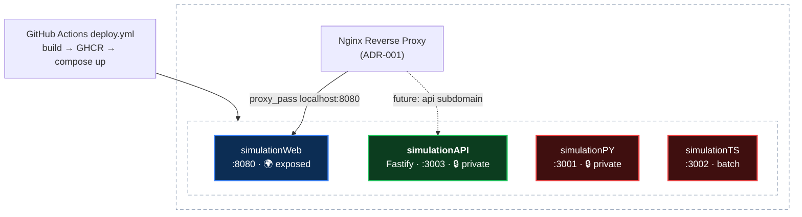

# ADR-002: Fastify backend container (simulationAPI)

## Requirements
- Add a long-running HTTP API backend container alongside the existing containers
- TypeScript end to end, consistent with the tech stack defaults (`docs/steering/tech-stack.md`)
- Deploy through the existing pipeline: GHCR image build + compose file synced to the EC2 box (`.github/workflows/deploy.yml` auto-discovers any `containers/<name>/Dockerfile`)
- Private by default (loopback only), exposable later via nginx subdomain routing per ADR-001
- Health endpoint so the box (and later nginx/monitoring) can check liveness

## Options
1. **New Fastify container (`containers/simulationAPI`)** — dedicated HTTP service, mirrors the simulationTS layout
2. **NestJS container** — batteries-included structure (DI, modules, decorators)
3. **Extend simulationTS with an HTTP server** — reuse the existing container instead of adding one

## Decision
New container `containers/simulationAPI` running Fastify on Node 24-alpine, bound to `127.0.0.1:3003` on the box.

## Rationale
- **Framework fit:** Per the tech-stack defaults, Fastify is the pick when a small service needs speed and clean types; NestJS's structure isn't warranted for a single-purpose API
- **Separation:** simulationTS is a batch job (runs to completion, `restart: "no"`); bolting a server onto it would conflate two lifecycles. A separate container keeps each compose file honest
- **Zero pipeline changes:** deploy.yml discovers any `containers/<name>/Dockerfile`, so the new container ships with no workflow edits
- **Consistency:** Same multi-stage Dockerfile pattern as simulationTS — digest-pinned `node:24-alpine`, `npm ci`, compile with `tsc`, runtime stage ships `dist` only
- **Private first:** Binding to loopback keeps it unreachable from the internet until an ADR-001-style nginx subdomain deliberately exposes it

## Tradeoffs
- One more image to build and one more container on the box (acceptable; the pipeline and compose layout already scale per-container)
- Fastify runtime deps mean the runtime stage needs production `node_modules`, unlike simulationTS's dependency-free dist (`npm ci --omit=dev` in the runtime stage keeps it lean)
- No framework-imposed structure like NestJS's — fine at this size; revisit if the API grows past a handful of routes or contributors

## Implementation
1. Scaffold `containers/simulationAPI`: `package.json` (`"type": "module"`), `tsconfig.json`, `src/` mirroring simulationTS conventions
2. Fastify server with a `GET /health` route; listen on `0.0.0.0:3003` inside the container
3. Multi-stage Dockerfile from digest-pinned `node:24-alpine`: build stage compiles TypeScript, runtime stage gets `dist` + `npm ci --omit=dev`
4. `docker-compose.yml` with `restart: unless-stopped` (long-running service, unlike the batch jobs) and `ports: "127.0.0.1:3003:3003"`
5. Merge to main; deploy.yml builds, pushes to GHCR, syncs the compose file, and runs `up -d` on the box
6. Later, when the API should be public: add an nginx server block + Let's Encrypt cert on a subdomain, per ADR-001

## Architecture Diagram

