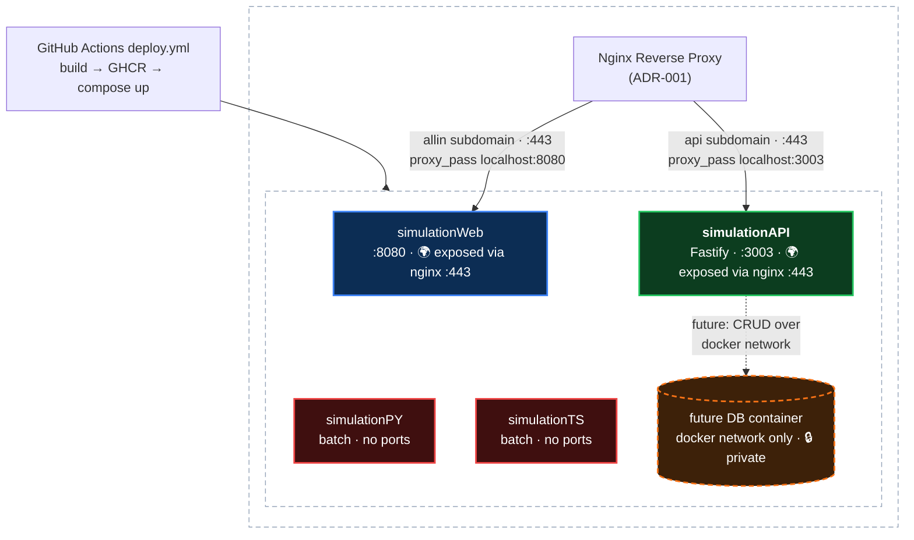

# ADR-002: Fastify backend container (simulationAPI)

Date: 2026-07-02

## Requirements
- Add a long-running HTTP API backend container alongside the existing containers
- TypeScript end to end, consistent with the tech stack defaults (`docs/steering/tech-stack.md`)
- Deploy through the existing pipeline: GHCR image build + compose file synced to the EC2 box (`.github/workflows/deploy.yml` auto-discovers any `containers/<name>/Dockerfile`)
- Publicly reachable over HTTPS (443) from day one, via nginx subdomain routing + Let's Encrypt per ADR-001
- Will serve as the CRUD layer for a future DB container; the DB itself stays private (docker network only, no host ports)
- Health endpoint so the box, nginx, and monitoring can check liveness
- Callable from the browser at `allin.makejohnacoffee.com` — a different subdomain than the API, so the API must send CORS headers

## Options
1. **New Fastify container (`containers/simulationAPI`)** — dedicated HTTP service, mirrors the simulationTS layout
2. **NestJS container** — batteries-included structure (DI, modules, decorators)
3. **Extend simulationTS with an HTTP server** — reuse the existing container instead of adding one

## Decision
New container `containers/simulationAPI` running Fastify on Node 24-alpine, bound to `127.0.0.1:3003` on the box and exposed publicly on 443 through an nginx server block on an API subdomain (ADR-001 pattern). Nginx terminates TLS; the container itself never listens on a public interface.

Request/response validation uses **zod** via `fastify-type-provider-zod`: route schemas are defined once in zod and provide runtime validation, inferred TypeScript types on handlers, and OpenAPI generation. Schemas shared with the front end live in a shared package so the same definitions validate on both sides.

## Rationale
- **Framework fit:** Per the tech-stack defaults, Fastify is the pick when a small service needs speed and clean types; NestJS's structure isn't warranted for a single-purpose API
- **Separation:** simulationTS is a batch job (runs to completion, `restart: "no"`); bolting a server onto it would conflate two lifecycles. A separate container keeps each compose file honest
- **Zero pipeline changes:** deploy.yml discovers any `containers/<name>/Dockerfile`, so the new container ships with no workflow edits
- **Consistency:** Same multi-stage Dockerfile pattern as simulationTS — digest-pinned `node:24-alpine`, `npm ci`, compile with `tsc`, runtime stage ships `dist` only
- **Loopback + nginx, not direct exposure:** The container binds to `127.0.0.1:3003`; from the internet, nginx (443) is the only path in. On the box itself, local processes and co-networked containers can still reach it directly — one more reason auth lives in the API, not nginx. TLS termination, cert renewal, and exposure decisions stay in one place per ADR-001, and no new security-group ports are needed (80/443 are already open)
- **DB stays behind the API:** The future DB container joins a shared docker network with simulationAPI as its only client — all CRUD flows through the API over HTTPS, and the DB never gets a host port
- **Zod over valibot for validation:** Both work FE and BE, but zod's Fastify integration is first-class — `fastify-type-provider-zod` is mature and actively maintained, while valibot's route through Fastify is either a JSON Schema conversion layer (`@valibot/to-json-schema`, which drops transforms/custom checks) or stale/0.x type providers. Valibot's historical bundle-size edge is mostly closed by zod 4's tree-shakeable `zod/mini`. One library end to end with the least glue is the boring choice per the tech-stack defaults

## Tradeoffs
- One more image to build and one more container on the box (acceptable; the pipeline and compose layout already scale per-container)
- Fastify runtime deps mean the runtime stage needs production `node_modules`, unlike simulationTS's dependency-free dist (`npm ci --omit=dev` in the runtime stage keeps it lean)
- No framework-imposed structure like NestJS's — fine at this size; revisit if the API grows past a handful of routes or contributors
- Public from day one means the CRUD surface is internet-reachable before any real consumers exist — auth/rate-limiting must land in the API before mutating routes do, since nginx only handles TLS
- ~~The API's nginx server block is applied by hand on the box for now, not through Terraform — it would not survive a box rebuild (see step 7). Accepted temporarily; the multi-vhost IaC story lands with the DB container ADR~~ *Resolved 2026-07-03: `user_data.sh.tftpl` now takes an `api_domain` variable and provisions the API vhost, its own Let's Encrypt cert, and per-IP nginx rate limiting at first boot — the box is recreated to pick it up*

## Implementation
1. Scaffold `containers/simulationAPI`: `package.json` (`"type": "module"`), `tsconfig.json`, `src/` mirroring simulationTS conventions
2. Fastify server with a `GET /health` route; listen on `0.0.0.0:3003` inside the container. Register `@fastify/cors` with the web origin (`https://allin.makejohnacoffee.com`) allowed, since browser calls to the API subdomain are cross-origin
3. Wire up zod validation: add `zod` and `fastify-type-provider-zod`, set the validator/serializer compilers, and type routes with `ZodTypeProvider` — every route from the first one carries a zod schema
4. Multi-stage Dockerfile from digest-pinned `node:24-alpine`: build stage compiles TypeScript; runtime stage copies `package.json` **and** `package-lock.json` (unlike simulationTS's runtime stage, which skips the lockfile — `npm ci` needs it), runs `npm ci --omit=dev`, then adds `dist`
5. `docker-compose.yml` with `restart: unless-stopped` (long-running service, unlike the batch jobs), `ports: "127.0.0.1:3003:3003"`, and a `healthcheck` hitting `GET /health` — so the box reports liveness even before the nginx server block (step 7) is in place. The check must use a tool that exists in the image: `node:24-alpine` ships busybox `wget` but no `curl`, so use `wget -qO- http://localhost:3003/health` (or a node one-liner)
6. Merge to main; deploy.yml builds, pushes to GHCR, syncs the compose file, and runs `up -d` on the box
7. Expose on 443 per ADR-001: point an API subdomain (e.g. `api.makejohnacoffee.com`) at the EC2 IP, add an nginx server block proxying to `localhost:3003`, and issue its Let's Encrypt cert — no security-group changes (80/443 already open). **Known gap:** the existing simulationWeb vhost is provisioned by Terraform via `infra/user_data.sh.tftpl` (templated on a single `app_domain`), and user_data only runs at first boot — so this new server block will initially be applied by hand on the box and would be lost on a rebuild. ~~Deferred deliberately: the IaC story for multiple vhosts (parameterizing the template, and how changes land on a running box) will be addressed alongside the DB container ADR, which brings more rebuild complexity anyway~~ *Update 2026-07-03: done in Terraform instead of by hand — the template now takes `api_domain`, writes the API vhost, issues a separate cert per subdomain, and adds per-IP rate limiting (web 30 r/s, API 10 r/s, 429 on excess); applied by recreating the EC2 instance (`terraform apply -replace=aws_instance.app`)*
8. Later, when the DB container lands: shared docker network between simulationAPI and the DB, CRUD routes in the API, no host ports on the DB

## Architecture Diagram

