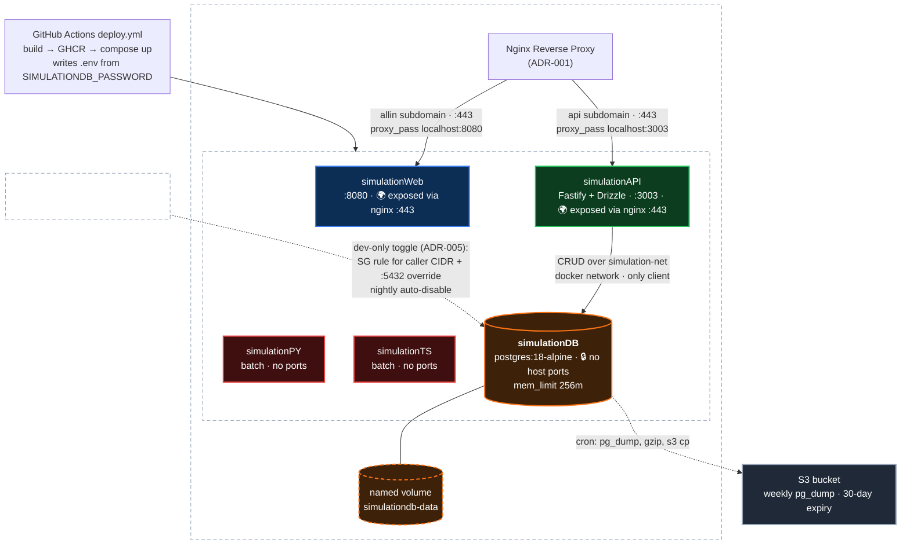

# ADR-003: Database container (simulationDB)

Date: 2026-07-03

## Requirements
- Add a persistent database container alongside the existing containers, per the plan laid out in ADR-002
- Private by design: joins a shared docker network with simulationAPI as its only client — no host ports, never internet-reachable in normal operation (ADR-002). Exception: a manual, dev-only toggle for temporary public access (ADR-005)
- All reads/writes flow through simulationAPI's CRUD layer over HTTPS
- Deploy through the existing pipeline: GHCR image build (or upstream image) + compose file synced to the EC2 box via `.github/workflows/deploy.yml`
- Data must survive container restarts and redeploys (named volume); story needed for surviving a box rebuild (backups)
- Healthcheck so the box and monitoring can check liveness
- Consistent with the tech stack defaults (`docs/steering/tech-stack.md`)
- ORM that plays nicely with zod validation + typescript and handles migrations

## Options

Two choices to make: the database itself, and the ORM that simulationAPI uses to talk to it (per the new requirement: zod-friendly, TypeScript-native, owns migrations).

### Database
1. **PostgreSQL container (`containers/simulationDB`, official `postgres` image)** — the tech-stack default; upstream digest-pinned image (no custom build), named volume for data, joins the shared docker network with simulationAPI
2. **AWS RDS Postgres (managed, via Terraform)** — same engine but off the box; AWS owns backups, upgrades, and durability, at the cost of leaving the compose/deploy.yml pipeline and adding standing spend
3. **SQLite on a volume inside simulationAPI** — no new container at all; an embedded file database accessed in-process, with the named volume providing persistence

### ORM
1. **Drizzle ORM** — TypeScript-first, schema defined in TS code; `drizzle-kit` generates plain SQL migrations; first-party `drizzle-zod` derives zod schemas straight from table definitions
2. **Prisma** — schema in its own DSL with generated client types; `prisma migrate` for migrations; zod integration only via third-party generators
3. **Kysely** — type-safe SQL query builder rather than a full ORM; ships a migration runner; zod schemas written and kept in sync by hand

## Decision

### Database
**PostgreSQL container** — new `containers/simulationDB` running the official digest-pinned `postgres` image (no custom build, no Dockerfile). It joins a shared docker network with simulationAPI as its only client, publishes no host ports, and persists data on a named volume. Ships with the memory guardrails from the Implementation section.

### ORM
**Drizzle** — on the stable line, not the v1 RC: `drizzle-orm` 0.45.x with the `pg` driver and `drizzle-zod` 0.8.x in simulationAPI, `drizzle-kit` 0.31.x as a dev dependency for generating SQL migrations. Migrations run programmatically at API startup. When drizzle-orm v1 goes stable, the validators fold into the core package (`drizzle-orm/zod`) — a cheap import-path migration.

## Rationale

### Database
- **Stack default:** PostgreSQL is the stated data default in `docs/steering/tech-stack.md` — the boring choice, and with JSONB it covers the document-store cases too
- **Lowest cost:** runs on the box already paid for. RDS is the only option with standing spend (~$15+/mo at its smallest), buying managed durability we can approximate with scheduled `pg_dump`-to-S3 backups for pennies
- **Headroom verified, not assumed:** measured 2026-07-03 — ~471 MiB available on the box against an idle Postgres footprint of ~40–80 MiB, with compose-level guardrails capping the worst case (see Tradeoffs and Implementation)
- **Why not SQLite, the even-cheaper option:** it embeds the database inside simulationAPI's lifecycle — no independent healthcheck or liveness story, and it walks back ADR-002's stated plan of a private DB container with the API as its only client. The marginal cost of the Postgres container is one upstream image on a box with verified headroom
- **Zero new operational surface:** upstream image + compose file through the existing deploy.yml sync, same model as every other container on the box (the pipeline tweak for a Dockerfile-less container is noted in Tradeoffs)

### ORM
- **First-party zod integration (verified 2026-07-03):** `drizzle-zod` is maintained by the drizzle team in the drizzle-orm monorepo — current 0.8.3, peer deps `zod ^3.25 || ^4` (compatible with ADR-002's zod) and `drizzle-orm >= 0.36`. `createSelectSchema`/`createInsertSchema`/`createUpdateSchema` derive zod schemas straight from table definitions — least glue of the three, mirroring ADR-002's zod-over-valibot reasoning. And it's getting *more* first-party: drizzle-orm v1 (at 1.0.0-rc.4) folds the validators into the core package as `drizzle-orm/zod`, ending the separate peer-dep package. By contrast, Prisma reaches zod only through third-party generators — the most established (`zod-prisma-types`) is officially in maintenance mode (critical fixes only), and the active alternative (`prisma-zod-generator`) is also third-party. Kysely has nothing beyond community wrappers and an open feature request on `kysely-codegen`; schemas are synced by hand
- **Migrations are plain SQL:** `drizzle-kit` generates readable SQL files — reviewable in a PR and fixable by hand, no proprietary migration format
- **TypeScript-first:** schema lives in TS code with inferred types, no separate DSL or codegen step between the schema and the route handlers

## Tradeoffs

### Database (PostgreSQL container)
- **Durability is on us, not AWS.** The named volume survives restarts and redeploys, but it lives on the instance disk — a box rebuild (`terraform apply -replace=aws_instance.app`, which ADR-002 just did) destroys it. Backups (e.g. scheduled `pg_dump` to S3) must land before any data worth keeping does; RDS would have owned this for money
- **Self-managed upgrades.** Minor Postgres bumps are an image-tag change, but major versions change the on-disk data format — the pipeline can't just roll the tag; someone runs a dump/restore or `pg_upgrade` by hand
- **Another always-on container on a small box.** Measured on the box 2026-07-03: 916 MiB total, ~471 MiB available, **no swap**; simulationAPI + simulationWeb together use ~36 MiB. An idle Postgres (~40–80 MiB) fits comfortably, but the default `shared_buffers` (128 MB) plus per-connection memory means an unconstrained Postgres under real load could invite the OOM killer — so it ships with guardrails (see Implementation). The SQLite option would have cost nothing
- **First real secret in the stack.** The DB password has to live somewhere the compose file and simulationAPI can both see it (env file on the box / GitHub secret) — a small but new class of thing the deploy pipeline hasn't handled yet
- **Deviates from the one-Dockerfile-per-container pattern.** The upstream `postgres` image means no build step, so `deploy.yml`'s `containers/<name>/Dockerfile` auto-discovery doesn't apply — the pipeline needs to sync and `up` a compose-only container dir
- **No host port cuts both ways.** Private by design, but ad-hoc inspection means `docker exec` into the container (or an SSH tunnel) rather than pointing a local client at a port — mitigated by the dev-only access toggle (ADR-005), which is itself the next tradeoff
- **The dev access toggle is a deliberate hole in "never internet-reachable".** While enabled, the DB is one password away from the internet (scoped to the caller's CIDR). Contained by: no `0.0.0.0/0` wildcard, OIDC-scoped credentials, and a nightly auto-disable failsafe. Note the SG rule is created outside Terraform — a `terraform apply` while access is enabled may revert it, which conveniently fails closed, not open

### ORM (Drizzle)
- **Drizzle is the youngest of the three ORM options.** Smaller ecosystem than Prisma, and `drizzle-kit`'s generated SQL occasionally needs hand-editing for gnarlier schema changes — offset by migrations being plain SQL you can read and fix
- **`drizzle-zod` couples API shapes to table shapes.** Deriving route schemas from the DB is exactly the ADR-002 share-one-definition goal today, but as the API grows, DTOs and rows will diverge — at that point some routes get hand-written zod schemas alongside the derived ones

## Implementation

Versions pinned as of 2026-07-03: `postgres:18-alpine` (18.4), `drizzle-orm` 0.45.2, `drizzle-kit` 0.31.10, `drizzle-zod` 0.8.3.

Landing plan (decided 2026-07-03): split PRs — (1) infra: docker network, swapfile, backup cron, S3 bucket + IAM; (2) simulationDB container + deploy.yml tweaks; (3) Drizzle, migrations, and the first CRUD resource in simulationAPI; (4) the dev access toggle, per ADR-005, after the core lands. Once merged, the box is deliberately rebuilt (`terraform apply -replace=aws_instance.app`) to bake the `user_data` changes — and to prove the rebuild story while there is still no data to lose.

1. **Shared docker network** — create `simulation-net` idempotently in `infra/user_data.sh.tftpl` (so it survives a box rebuild) and as a pre-step in deploy.yml (`docker network create simulation-net || true`, covers the already-running box); both simulationAPI's and simulationDB's compose files declare it `external`
2. **`containers/simulationDB/docker-compose.yml`** — compose file only, no Dockerfile (upstream image): digest-pinned `postgres:18-alpine`, `restart: unless-stopped`, **no `ports:` key at all** (docker network only), credentials via `env_file: .env`. **PG 18 image gotcha:** the volume mount point moved from `/var/lib/postgresql/data` to `/var/lib/postgresql` (PGDATA is now version-specific: `/var/lib/postgresql/18/docker`) — mount the named volume as `simulationdb-data:/var/lib/postgresql`; the old path silently leaves data outside the volume
3. **Memory guardrails in the same compose file** (from the 2026-07-03 box check: 916 MiB total, ~471 MiB available, no swap): `mem_limit: 256m` and `command: -c shared_buffers=64MB`, plus a `healthcheck` using `pg_isready -U $$POSTGRES_USER -d $$POSTGRES_DB` (ships in the image)
4. **Secret plumbing** — new GitHub Actions secret `SIMULATIONDB_PASSWORD`; deploy.yml writes `containers/simulationDB/.env` (`POSTGRES_USER`, `POSTGRES_PASSWORD`, `POSTGRES_DB`) and simulationAPI's `DATABASE_URL` on every deploy. Reproducible on box rebuild; rotation = update the secret + redeploy
5. **deploy.yml: compose-only container** — the build/GHCR steps key off `containers/<name>/Dockerfile`; make sure the sync + `up -d` path also covers a directory with only a compose file (small tweak if discovery is Dockerfile-keyed)
6. **Drizzle in simulationAPI** — add `drizzle-orm` (0.45.x), `drizzle-zod` (0.8.x), and `pg` as runtime deps (the derived zod schemas validate live requests); `drizzle-kit` (0.31.x) as a dev dep. Table definitions in `src/db/schema.ts`, `drizzle.config.ts` at the package root, generated SQL migrations committed under `drizzle/`
7. **Migrations at API startup** — call `migrate(db, { migrationsFolder })` from `drizzle-orm/node-postgres/migrator` before `listen()`. Two consequences: the runtime Docker stage must copy `drizzle/` alongside `dist`, and since the API and DB live in separate compose projects (`depends_on` can't reach across), the API needs a bounded connect-retry loop at boot rather than assuming the DB is up
8. **CRUD routes** — first resource: **simulation results**, with the table design derived from what the simulationPY/simulationTS batch jobs actually produce. Zod route schemas derived from the table definitions via `createSelectSchema`/`createInsertSchema`, plugged into the existing `fastify-type-provider-zod` setup from ADR-002
9. **Backups, weekly** — Terraform: private S3 bucket with a lifecycle rule (expire dumps after ~30 days) and `s3:PutObject` added to the existing instance role; weekly cron entry in `user_data.sh.tftpl`: `docker exec simulationdb pg_dump -U $POSTGRES_USER $POSTGRES_DB | gzip | aws s3 cp - s3://<bucket>/simulationdb/$(date +%F).sql.gz`. Cost note: at this data size S3 is effectively free (<$0.01/mo) — the cadence is a data-loss-window choice, not a cost one; tightening to nightly later is a one-line cron change. Restore path (`aws s3 cp` + `gunzip | psql`) must be proven before real data lands — spun out to ADR-004 (draft)
10. **Swapfile safety net** — add a 512 MiB swapfile to `user_data.sh.tftpl`; takes effect at the next box rebuild (as does the backup cron — until then, apply both by hand or rebuild deliberately)
11. **Dev-only public access toggle** — spun out to **ADR-005** (draft): a manual `workflow_dispatch` workflow toggling an SG rule (caller CIDR) plus a compose port override, connecting via `db.makejohnacoffee.com:5432`, with OIDC-scoped credentials and a nightly auto-disable. Implemented after this ADR's core lands
12. **Verify on the box** — `docker stats` for the memory picture with Postgres running; exercise a CRUD route over HTTPS end to end; `docker compose down && up -d` on simulationDB to confirm the volume persists data; run one backup manually and restore it somewhere disposable

## Architecture Diagram

